---
# Front matter
lang: ru-RU
title: "Отчёт по лабораторной работе №4"
subtitle: "Основы интерфейса взаимодействия пользователя с системой Unix на уровне командной строки"
author: "Леденев Егор Олегович"

lang: ru-RU
bibliography: bib/cite.bib
csl: pandoc/csl/gost-r-7-0-5-2008-numeric.csl

# Formatting
toc-title: "Содержание"
toc: true # Table of contents
toc_depth: 2
lof: true # List of figures
fontsize: 12pt
linestretch: 1.5
papersize: a4paper
documentclass: scrreprt
polyglossia-lang: russian
polyglossia-otherlangs: english
mainfont: PT Serif
romanfont: PT Serif
sansfont: PT Sans
monofont: PT Mono
mainfontoptions: Ligatures=TeX
romanfontoptions: Ligatures=TeX
sansfontoptions: Ligatures=TeX,Scale=MatchLowercase
monofontoptions: Scale=MatchLowercase
babel-lang: russian
babel-otherlangs: english
biblatex: true
biblio-style: "gost-numeric"
biblatexoptions:
  - parentracker=true
  - backend=biber
  - hyperref=auto
  - language=auto
  - autolang=other*
  - citestyle=gost-numeric
figureTitle: "Рис."
tableTitle: "Таблица"
listingTitle: "Листинг"
lofTitle: "Список иллюстраций"
lotTitle: "Список таблиц"
lolTitle: "Листинги"
indent: true
pdf-engine: lualatex
header-includes:
  - \linepenalty=10 # the penalty added to the badness of each line within a paragraph (no associated penalty node) Increasing the value makes tex try to have fewer lines in the paragraph.
  - \interlinepenalty=0 # value of the penalty (node) added after each line of a paragraph.
  - \hyphenpenalty=50 # the penalty for line breaking at an automatically inserted hyphen
  - \exhyphenpenalty=50 # the penalty for line breaking at an explicit hyphen
  - \binoppenalty=700 # the penalty for breaking a line at a binary operator
  - \relpenalty=500 # the penalty for breaking a line at a relation
  - \clubpenalty=150 # extra penalty for breaking after first line of a paragraph
  - \widowpenalty=150 # extra penalty for breaking before last line of a paragraph
  - \displaywidowpenalty=50 # extra penalty for breaking before last line before a display math
  - \brokenpenalty=100 # extra penalty for page breaking after a hyphenated line
  - \predisplaypenalty=10000 # penalty for breaking before a display
  - \postdisplaypenalty=0 # penalty for breaking after a display
  - \floatingpenalty = 20000 # penalty for splitting an insertion (can only be split footnote in standard LaTeX)
  - \raggedbottom # or \flushbottom
  - \usepackage{indentfirst}
  - \usepackage{float} # keep figures where there are in the text
  - \floatplacement{figure}{H} # keep figures where there are in the text
---

# Цель работы

Приобретение практических навыков взаимодействия пользователя с системой посредством командной строки.

# Выполнение лабораторной работы

1. Определим полное имя нашего домашнего каталога. При помощи команды  cd перейдем в домашний каталог и увидим что его название совпадает с именем пользователя. Путь к нашему домашнему каталогу покажет команда pwd.

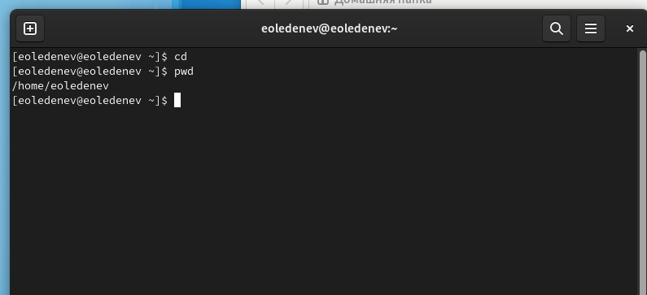{ #fig:001 width=70% }

2.1. Перейдем в каталог /tmp, при помощи команды cd/tmp.

2.2. Выведем на экран содержимое каталога /tmp. Для этого используйте команду ls с различными опциями.

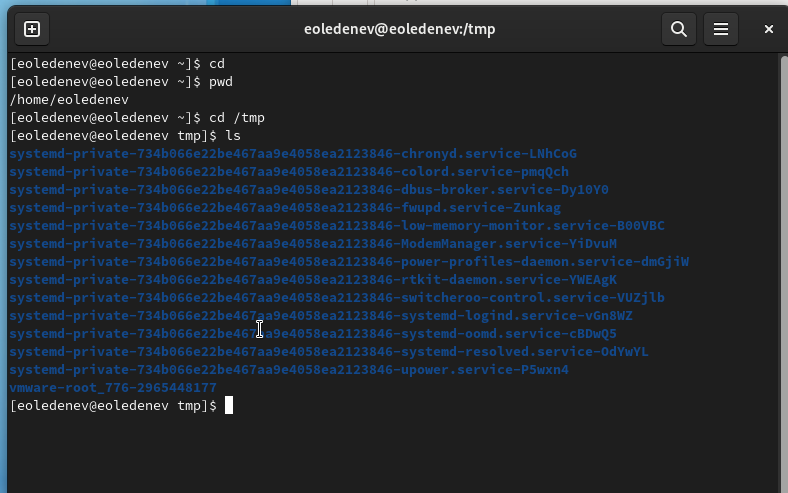{ #fig:002 width=70% }

Мы можем увидеть содержимое каталога со скрытыми файлами применив опцию -a

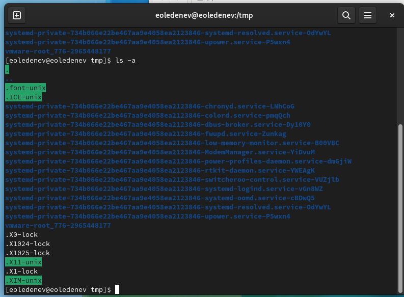{ #fig:003 width=70% }

Мы можем увидеть подробное содержимое каталога, применив опцию -l
Применив опцию -f можем увидеть файлы списком

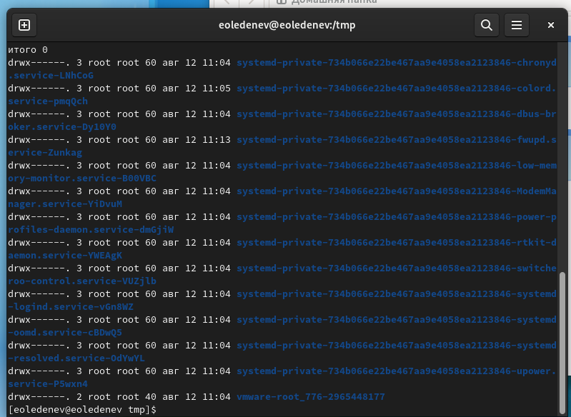{ #fig:004 width=70% }

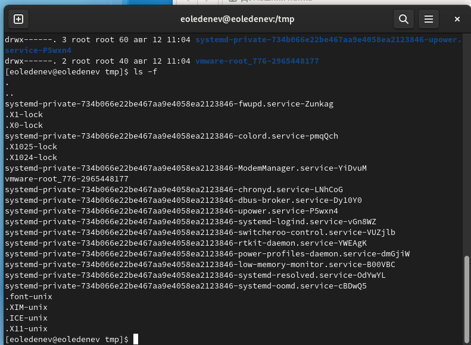{ #fig:005 width=70% }

2.3. Определили, есть ли в каталоге /var/spool подкаталог с именем cron. Нету.

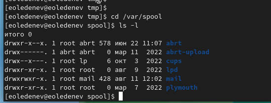{ #fig:006 width=70% }

2.4. Перешли в домашний каталог и вывели на экран его содержимое. Определили, кто является владельцами файлов и подкаталогов посредством команды ls -al. Большинство файлов принадлежат моему полбзователю и root.    

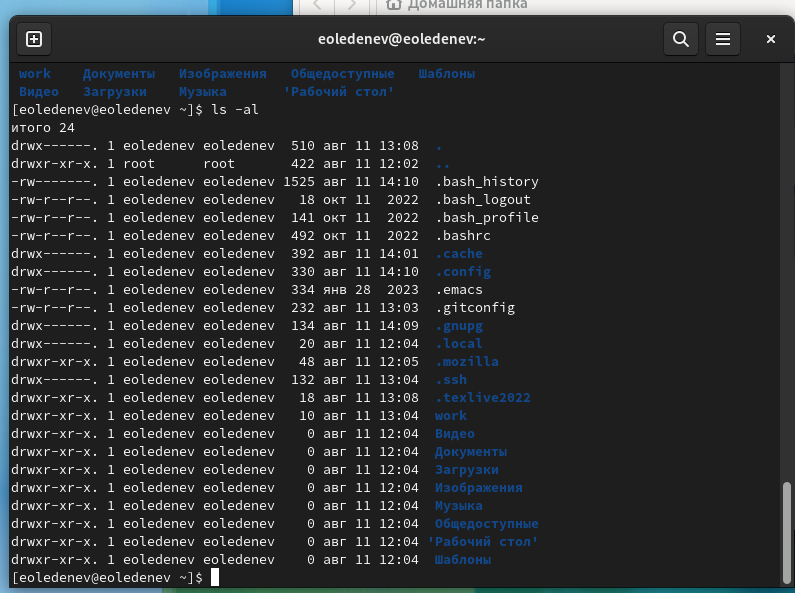{ #fig:007 width=70% }

3.1. В домашнем каталоге создали новый каталог с именем newdir при помощи команды mkdir.

3.2. В каталоге ~/newdir создали новый каталог с именем morefun.

3.3. В домашнем каталоге создали три новых каталога с именами letters, memos, misk, и затем удалили эти каталоги одной командой по конструкции    rm -r [имена файлов]. 

3.4. В задании к лабораторной предполагается, что каталог /newdir не получится удалить командой rm. Для этого сначала надо очистить каталог /newdir от подкаталога morefun. Но если использовать ключ -r к команде rm то тогда все удалится, не обращая внимания на подкаталоги.

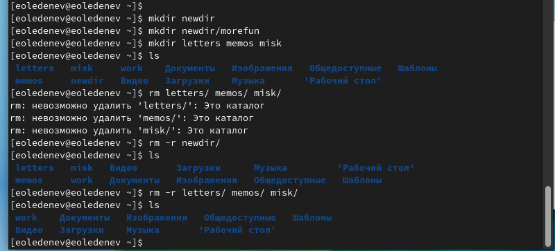{ #fig:008 width=70% }

4. С помощью команды man определим, какую опцию команды ls нужно использовать для просмотра содержимое не только указанного каталога, но и подката- логов, входящих в него. Введя в консоли man ls Мы получим справку на английском языке и в ней нужный нам ключ к команде. Это ключ -R

5. Также с помощью команды man определим набор опций команды ls, позволяющий отсортировать по времени последнего изменения выводимый список содержимого каталога с развёрнутым описанием файлов. Введя в консоли man ls  Мы получим справку на английском языке и в ней нужный нам ключ к команде. Это ключ -t.

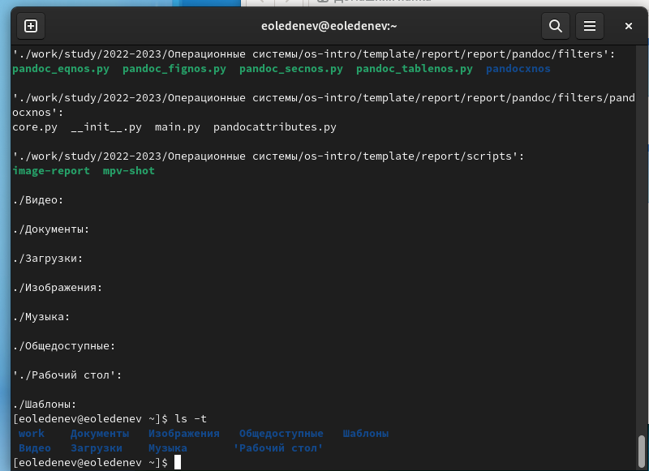{ #fig:009 width=70% }

6. Используем команду man для просмотра описания разных команд

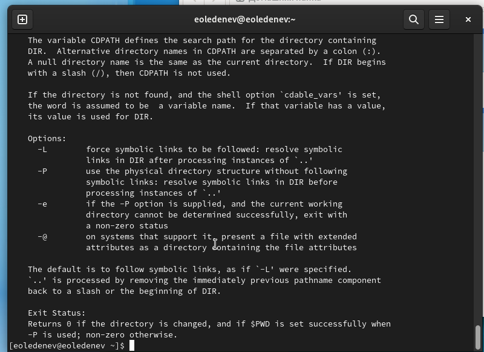{ #fig:010 width=70% }

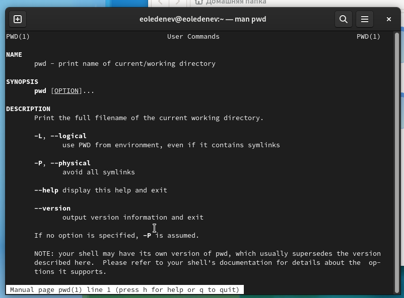{ #fig:011 width=70% }

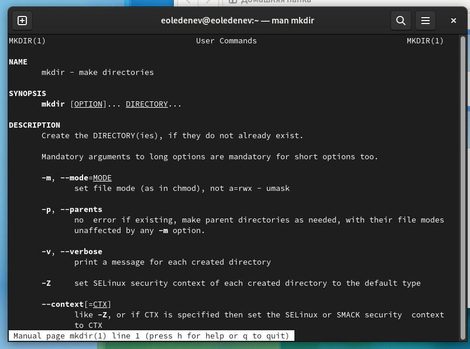{ #fig:012 width=70% }

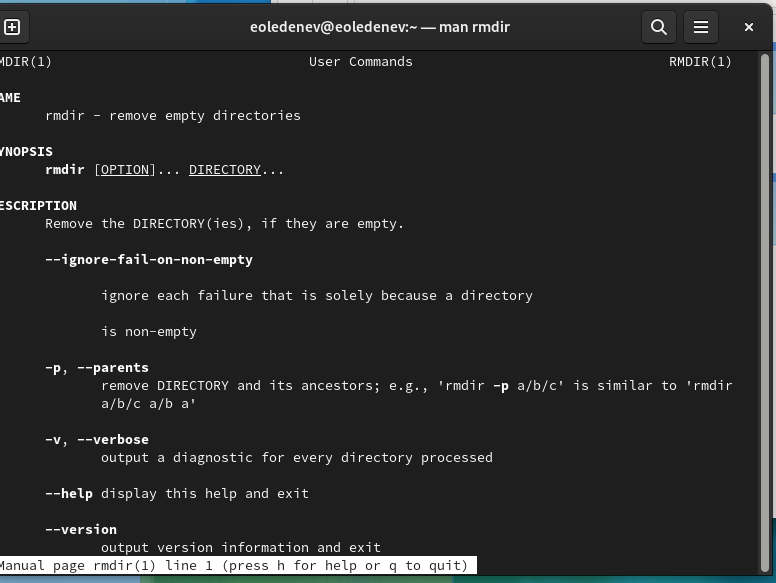{ #fig:013 width=70% }

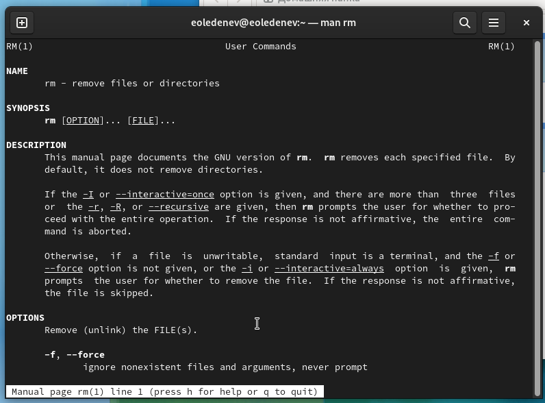{ #fig:014 width=70% }

7. Используя информацию, полученную при помощи команды history, выполним модификацию и исполнение нескольких команд из буфера команд.

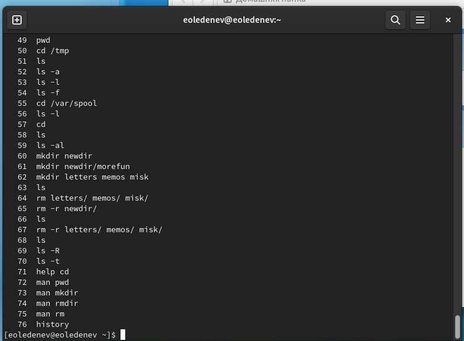{ #fig:015 width=70% }

# Вывод

Мы приобрели практические навыки взаимодействия пользователя с системой посредством командной строки.
