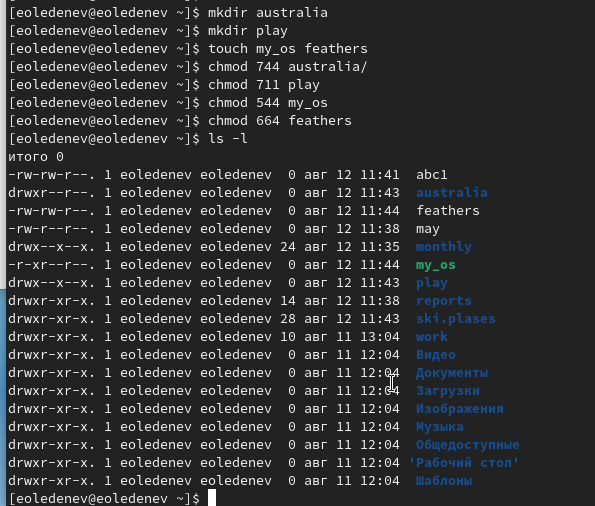

---
# Front matter
lang: ru-RU
title: "Отчёт по лабораторной работе №5"
subtitle: "Анализ файловой структуры UNIX. Команды для работы с файлами и каталогами"
author: "Леденев Егор Олегович"

# Formatting
toc-title: "Содержание"
toc: true # Table of contents
toc_depth: 2
lof: true # List of figures
fontsize: 12pt
linestretch: 1.5
papersize: a4paper
documentclass: scrreprt
polyglossia-lang: russian
polyglossia-otherlangs: english
mainfont: PT Serif
romanfont: PT Serif
sansfont: PT Sans
monofont: PT Mono
mainfontoptions: Ligatures=TeX
romanfontoptions: Ligatures=TeX
sansfontoptions: Ligatures=TeX,Scale=MatchLowercase
monofontoptions: Scale=MatchLowercase
indent: true
pdf-engine: lualatex
header-includes:
  - \linepenalty=10 # the penalty added to the badness of each line within a paragraph (no associated penalty node) Increasing the value makes tex try to have fewer lines in the paragraph.
  - \interlinepenalty=0 # value of the penalty (node) added after each line of a paragraph.
  - \hyphenpenalty=50 # the penalty for line breaking at an automatically inserted hyphen
  - \exhyphenpenalty=50 # the penalty for line breaking at an explicit hyphen
  - \binoppenalty=700 # the penalty for breaking a line at a binary operator
  - \relpenalty=500 # the penalty for breaking a line at a relation
  - \clubpenalty=150 # extra penalty for breaking after first line of a paragraph
  - \widowpenalty=150 # extra penalty for breaking before last line of a paragraph
  - \displaywidowpenalty=50 # extra penalty for breaking before last line before a display math
  - \brokenpenalty=100 # extra penalty for page breaking after a hyphenated line
  - \predisplaypenalty=10000 # penalty for breaking before a display
  - \postdisplaypenalty=0 # penalty for breaking after a display
  - \floatingpenalty = 20000 # penalty for splitting an insertion (can only be split footnote in standard LaTeX)
  - \raggedbottom # or \flushbottom
  - \usepackage{float} # keep figures where there are in the text
  - \floatplacement{figure}{H} # keep figures where there are in the text
---

# Цель работы

Ознакомление с файловой системой Linux, её структурой, именами и содержанием каталогов. Приобретение практических навыков по применению команд для работы с файлами и каталогами, по управлению процессами, по проверке использования диска и обслуживанию файловой системы.

# Выполнение лабораторной работы

1. Выполним примеры, приведённые в первой части описания лабораторной работы. 

{ #fig:001 width=70% }

{ #fig:002 width=70% }

{ #fig:003 width=70% }

2.1. Скопируем файл /usr/include/sys/io.h в домашний каталог и переименуем его equipment. Такого нет, взяли другой файл.

2.2. - 2.5. В домашнем каталоге создаем директорию ski.plases. и перемещаем в него файл equipment. Переименовываем файл equipment в equiplist. После этого создаем в домашнем каталоге файл abc1 и копируем его в каталог ski.plases. и переименовываем в equiplist2.
2.6. - 2.7. Создаем каталог с именем equipment в каталоге ski.plases. Перемещаем файлы equiplist и equiplist2 в каталог equipment.
2.8. Создаем и перемещаем каталог newdir в каталог ski.plases и называем его plans.

{ #fig:004 width=70% }

3. Определим опции команды chmod, необходимые для того, чтобы присвоить файлам из хода работы нужные права доступа.

a) Australia (drwxr--r--)
b) play (drwx--x--x)
c) My_oc (-r-xr--r--)
d) feathers (-rw-rw-r--)

{ #fig:005 width=70% }

4.1. Просмотрим содержимое файла /etc/passwd.

{ #fig:006 width=70% }

4.2 - 4.12. Выполним все указанные действия по перемещению файлов и каталогов 

{ #fig:007 width=70% }

4.7. Если мы попытаемся просмотреть файл feathers командой cat, то нам будет отказано в доступе.

4.8. Если мы попытаемся скопировать файл feathers то у нас не получется это сделать так как мы ограничили себя в доступе для чтения.

5. Прочитаем man по командам mount, fsck, mkfs, kill и кратко их охарактеризуем, приведя примеры.

{ #fig:008 width=70% }

Монтирование файловой системы к общему дереву каталогов. Для размонтирования используется команда unmonnt.

{ #fig:009 width=70% }

fsck (проверка файловой системы) – это утилита командной строки, которая позволяет выполнять проверки согласованности и интерактивное исправление в одной или нескольких файловых системах Linux. Она использует программы, специфичные для типа файловой системы, которую она проверяет. Вы можете использовать команду fsck для восстановления поврежденных файловых систем в ситуациях, когда система не загружается или раздел не может быть смонтирован.

{ #fig:010 width=70% }

Буквы в mkfs значке означают “make file system” (создать файловую систему). Команда обычно используется для управления устройствами хранения в Linux. Вы можете рассматривать mkfs как инструмент командной строки для форматирования диска в определенной файловой системе.

{ #fig:011 width=70% }

Системный вызов kill может быть использован для посылки какого-либо сигнала какому-либо процессу или группе процесса.

# Вывод

В ходе данной работы мы ознакомились с файловой системой Linux, её структурой, именами и содержанием каталогов. Научились совершать базовые операции с файлами, управлять правами их доступа для пользователя и групп. Ознакомились с Анализом файловой системы. А также получили базовые навыки по проверке использования диска и обслуживанию файловой системы.
