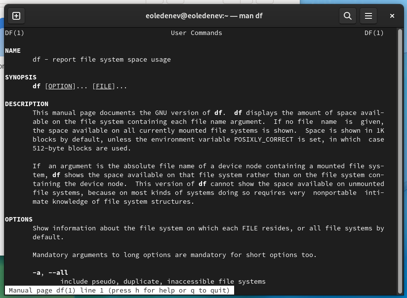

---
# Front matter
lang: ru-RU
title: "Отчёт по лабораторной работе №6"
subtitle: "Поиск файлов. Перенаправление ввода-вывода. Просмотр запущенных процессов"
author: "Леденев Егор Олегович"

# Formatting
toc-title: "Содержание"
toc: true # Table of contents
toc_depth: 2
lof: true # List of figures
fontsize: 12pt
linestretch: 1.5
papersize: a4paper
documentclass: scrreprt
polyglossia-lang: russian
polyglossia-otherlangs: english
mainfont: PT Serif
romanfont: PT Serif
sansfont: PT Sans
monofont: PT Mono
mainfontoptions: Ligatures=TeX
romanfontoptions: Ligatures=TeX
sansfontoptions: Ligatures=TeX,Scale=MatchLowercase
monofontoptions: Scale=MatchLowercase
indent: true
pdf-engine: lualatex
header-includes:
  - \linepenalty=10 # the penalty added to the badness of each line within a paragraph (no associated penalty node) Increasing the value makes tex try to have fewer lines in the paragraph.
  - \interlinepenalty=0 # value of the penalty (node) added after each line of a paragraph.
  - \hyphenpenalty=50 # the penalty for line breaking at an automatically inserted hyphen
  - \exhyphenpenalty=50 # the penalty for line breaking at an explicit hyphen
  - \binoppenalty=700 # the penalty for breaking a line at a binary operator
  - \relpenalty=500 # the penalty for breaking a line at a relation
  - \clubpenalty=150 # extra penalty for breaking after first line of a paragraph
  - \widowpenalty=150 # extra penalty for breaking before last line of a paragraph
  - \displaywidowpenalty=50 # extra penalty for breaking before last line before a display math
  - \brokenpenalty=100 # extra penalty for page breaking after a hyphenated line
  - \predisplaypenalty=10000 # penalty for breaking before a display
  - \postdisplaypenalty=0 # penalty for breaking after a display
  - \floatingpenalty = 20000 # penalty for splitting an insertion (can only be split footnote in standard LaTeX)
  - \raggedbottom # or \flushbottom
  - \usepackage{float} # keep figures where there are in the text
  - \floatplacement{figure}{H} # keep figures where there are in the text
---

# Цель работы

Ознакомление с инструментами поиска файлов и фильтрации текстовых данных. Приобретение практических навыков: по управлению процессами, по проверке  использования диска и обслуживанию файловых систем.

# Выполнение лабораторной работы

1 Включаем компьютер, и заходим в учетную запись.

2 Запишем в файл file.txt названия файлов, содержащихся в каталоге /etc. Допишем в этот же файл названия файлов, содержащихся в нашем домашнем каталоге. 

{ #fig:001 height=70% width=70% }

3 Выведем имена всех файлов из file.txt, имеющих расширение .conf, после чего запишем их в новый текстовой файл conf.txt. 

{ #fig:002 height=70% width=70% }

4 Определили, какие файлы в нашем домашнем каталоге имеют имена, начинавшиеся с символа c? 

{ #fig:003 height=70% width=70% }

5 Выведем на экран (постранично) имена файлов из каталога /etc, начинающиеся с символа h.

```
find /etc -name "h*" -print | less 
```

{ #fig:004 height=70% width=70% }

6 Запустили в фоновом режиме процесс, который будет записывать в 
файл ~/logfile файлы, имена которых начинаются с log. 
Процесс выполнен 

7 Удалили файл ~/logfile. Но сначала убили процесс в нем.

{ #fig:005 height=70% width=70% }

8 Запустили из консоли в фоновом режиме редактор gedit. 

9 Определили идентификатор процесса gedit, используя команду ps, конвейер и фильтр grep

10 Прочитали справку (man) команды kill, после чего используйте её для завершения процесса gedit. 

{ #fig:006 height=70% width=70% }

11 Выполним команды df и du, предварительно получив более подробную информацию об этих командах, с помощью команды man. 

{ #fig:007 height=70% width=70% }

{ #fig:008 height=70% width=70% }

{ #fig:009 height=70% width=70% }

{ #fig:010 height=70% width=70% }

12	Воспользовавшись справкой команды find, вывести имена всех директорий, имеющихся в нашем домашнем каталоге.

```
find ~ -type d
```

{ #fig:011 height=70% width=70% }

# Вывод

В данной работе мы ознакомились с инструментами поиска файлов и фильтрации текстовых данных. А также приобрели практические навыки по управлению процессами. 
