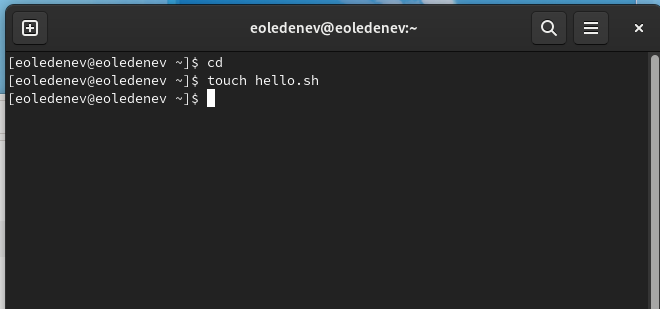
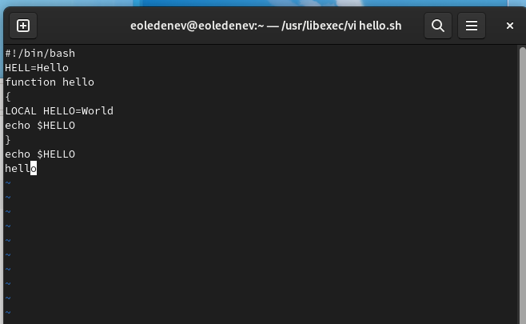
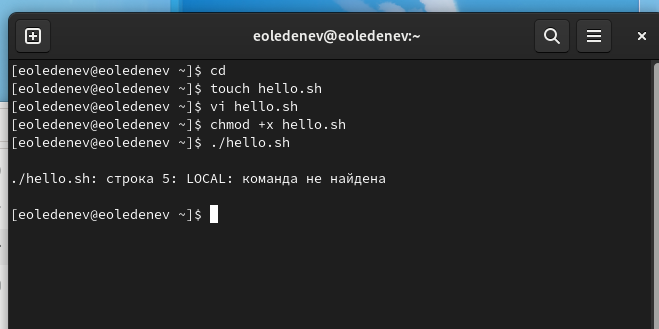
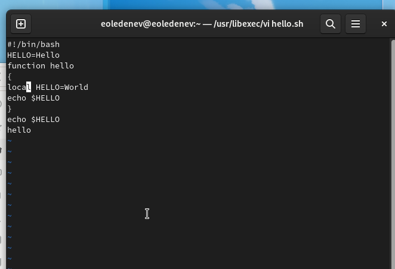
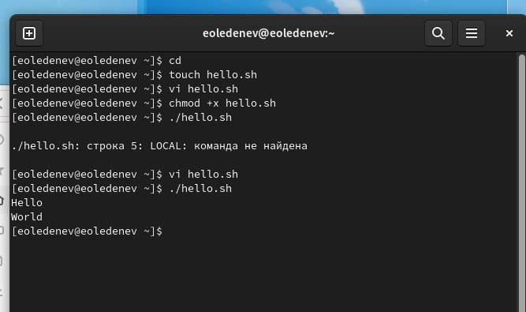

---
# Front matter
lang: ru-RU
title: "Отчёт по лабораторной работе №8"
subtitle: "Редактор Vi"
author: "Леденев Егор Олегович"

# Formatting
toc-title: "Содержание"
toc: true # Table of contents
toc_depth: 2
lof: true # List of figures
fontsize: 12pt
linestretch: 1.5
papersize: a4paper
documentclass: scrreprt
polyglossia-lang: russian
polyglossia-otherlangs: english
mainfont: PT Serif
romanfont: PT Serif
sansfont: PT Sans
monofont: PT Mono
mainfontoptions: Ligatures=TeX
romanfontoptions: Ligatures=TeX
sansfontoptions: Ligatures=TeX,Scale=MatchLowercase
monofontoptions: Scale=MatchLowercase
indent: true
pdf-engine: lualatex
header-includes:
  - \linepenalty=10 # the penalty added to the badness of each line within a paragraph (no associated penalty node) Increasing the value makes tex try to have fewer lines in the paragraph.
  - \interlinepenalty=0 # value of the penalty (node) added after each line of a paragraph.
  - \hyphenpenalty=50 # the penalty for line breaking at an automatically inserted hyphen
  - \exhyphenpenalty=50 # the penalty for line breaking at an explicit hyphen
  - \binoppenalty=700 # the penalty for breaking a line at a binary operator
  - \relpenalty=500 # the penalty for breaking a line at a relation
  - \clubpenalty=150 # extra penalty for breaking after first line of a paragraph
  - \widowpenalty=150 # extra penalty for breaking before last line of a paragraph
  - \displaywidowpenalty=50 # extra penalty for breaking before last line before a display math
  - \brokenpenalty=100 # extra penalty for page breaking after a hyphenated line
  - \predisplaypenalty=10000 # penalty for breaking before a display
  - \postdisplaypenalty=0 # penalty for breaking after a display
  - \floatingpenalty = 20000 # penalty for splitting an insertion (can only be split footnote in standard LaTeX)
  - \raggedbottom # or \flushbottom
  - \usepackage{float} # keep figures where there are in the text
  - \floatplacement{figure}{H} # keep figures where there are in the text
---

# Цель работы

Познакомиться с операционной системой Linux. Получить практические навыки работы с редактором vi, установленным по умолчанию практически во всех дистрибутивах.

# Выполнение лабораторной работы

1. Создадим каталог с именем ~/work/os/lab06. 

2. Перейдем во вновь созданный каталог. 

{ #fig:001 width=70% height=70% }

3. Вызовем vi и создадим файл hello.sh vi hello.sh 

4. Нажмем клавишу i и введем текст из задания.
 
5. Нажмем клавишу Esc для перехода в командный режим после завершения ввода текста. 

6. Нажмем : для перехода в режим последней строки и внизу нашего экрана появится приглашение в виде двоеточия. 

7. Нажмем w (записать) и q (выйти), а затем нажмем клавишу Enter для сохранения нашего текста и завершения работы. 

{ #fig:002 width=70% height=70% }

8. Сделаем наш файл исполняемым и попытаемся его исполнить.

{ #fig:003 width=70% height=70% }

9. Вызовем vi на редактирование файла vi ~/work/os/lab06/hello.sh 

10. Установим курсор в конец слова HELL второй строки. 

11. Перейдем в режим вставки и заменим на HELLO. Нажмем Esc для возврата в командный режим. 

12. Установим курсор на четвертую строку и сотрем слово LOCAL. 

13. Перейдем в режим вставки и наберем следующий текст: local, нажмем Esc для возврата в командный режим. 

14. Установим курсор на последней строке файла. Вставим после неё строку, со- держащую следующий текст: echo $HELLO. 

15. Нажмем Esc для перехода в командный режим. 

16. Удалим последнюю строку. 

17. Введем команду отмены изменений u для отмены последней команды. 

18. Введем символ : для перехода в режим последней строки. Запишем произведённые изменения и выйдем из vi.

{ #fig:004 width=70% height=70% }

{ #fig:005 width=70% height=70% }

# Вывод

 В ходе роботы мы  познакомились с операционной системой Linux, и получили практические навыки работы с редактором vi, установленным по умолчанию практически во всех дистрибутивах UNIX. А также освоили основные режимы и команды
