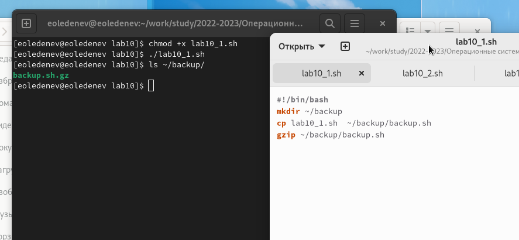
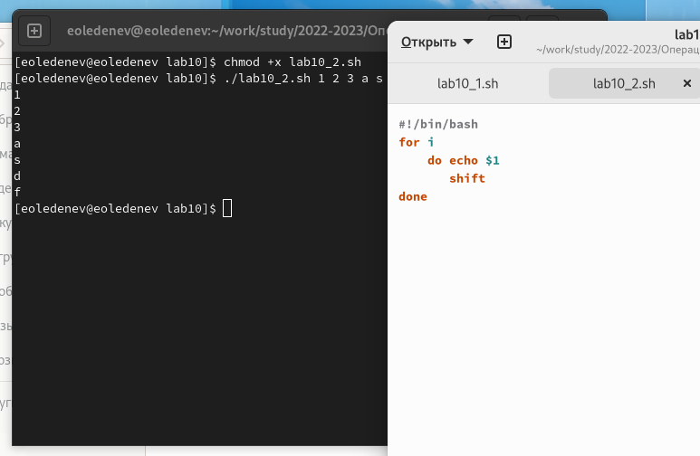
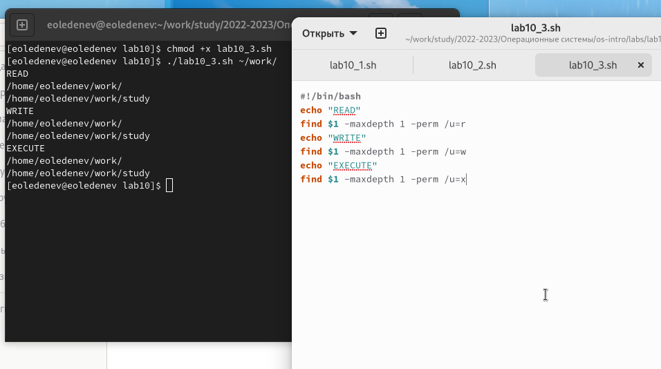

---
# Front matter
lang: ru-RU
title: "Отчёт по лабораторной работе №10"
subtitle: "Программирование в командном процессоре ОС UNIX. Командные файлы"
author: "Леденев Егор Олегович"

# Formatting
toc-title: "Содержание"
toc: true # Table of contents
toc_depth: 2
lof: true # List of figures
fontsize: 12pt
linestretch: 1.5
papersize: a4paper
documentclass: scrreprt
polyglossia-lang: russian
polyglossia-otherlangs: english
mainfont: PT Serif
romanfont: PT Serif
sansfont: PT Sans
monofont: PT Mono
mainfontoptions: Ligatures=TeX
romanfontoptions: Ligatures=TeX
sansfontoptions: Ligatures=TeX,Scale=MatchLowercase
monofontoptions: Scale=MatchLowercase
indent: true
pdf-engine: lualatex
header-includes:
  - \linepenalty=10 # the penalty added to the badness of each line within a paragraph (no associated penalty node) Increasing the value makes tex try to have fewer lines in the paragraph.
  - \interlinepenalty=0 # value of the penalty (node) added after each line of a paragraph.
  - \hyphenpenalty=50 # the penalty for line breaking at an automatically inserted hyphen
  - \exhyphenpenalty=50 # the penalty for line breaking at an explicit hyphen
  - \binoppenalty=700 # the penalty for breaking a line at a binary operator
  - \relpenalty=500 # the penalty for breaking a line at a relation
  - \clubpenalty=150 # extra penalty for breaking after first line of a paragraph
  - \widowpenalty=150 # extra penalty for breaking before last line of a paragraph
  - \displaywidowpenalty=50 # extra penalty for breaking before last line before a display math
  - \brokenpenalty=100 # extra penalty for page breaking after a hyphenated line
  - \predisplaypenalty=10000 # penalty for breaking before a display
  - \postdisplaypenalty=0 # penalty for breaking after a display
  - \floatingpenalty = 20000 # penalty for splitting an insertion (can only be split footnote in standard LaTeX)
  - \raggedbottom # or \flushbottom
  - \usepackage{float} # keep figures where there are in the text
  - \floatplacement{figure}{H} # keep figures where there are in the text
---

# Цель работы

Изучить основы программирования в оболочке ОС UNIX/Linux. Научиться писать небольшие командные файлы.

# Выполнение лабораторной работы

1. Написали скрипт, который при запуске делает резервную копию самого себя (то есть файла, в котором содержится его исходный код) в другую директорию backup в моём домашнем каталоге. При этом файл архивируется одним из архиваторов на выбор zip , bzip2 или tar . Способ использования команд архивации узнали, изучив справку.

Комментарий: командой cp копируем файл в директорию ~/backup/, а командой gzip исходный файл архивируется и удаляется (остаётся только архив).

{ #fig:001 width=70% height=70% }

2. Написали пример командного файла, обрабатывающего любое произвольное число аргументов командной строки, в том числе превышающее десять. Например, скрипт может последовательно распечатывать значения всех переданных аргументов

```
for i — для всех переданных аргументов
    do echo $1 — выводим первый аргумент
       shift — удаляем первый аргумент, смещаем все аргументы
done — конец цикла
```

{ #fig:002 width=70% height=70% }

3. Написали командный файл — аналог команды ls (без использования самой этой команды и команды dir ). Он выдает информацию о нужном каталоге и выводит информацию о возможностях доступа к файлам этого каталога.

Комментарий: если не использовать команду ls или команду dir, то данную задачу легко выполнить с помощью команды find, если указать ей опцию поиска файлов с определенным правом доступа

{ #fig:003 width=70% height=70% }

4. Написали командный файл, который получает в качестве аргумента командной строки формат файла ( .txt , .doc , .jpg , .pdf и т.д.) и вычисляет количество таких файлов в указанной директории. Путь к директории также передаётся в виде аргумента командной строки.

Комментарий: ищем командой find в каталоге $1 (первый аргумент) файлы заканчивающиеся "*" на нужное расширение $2 (аргумент второй) передаем вывод | в команду подсчета wc с аргументом считающим слова -l

![Задание 4]](image/04.png){ #fig:004 width=70% height=70% }

# Вывод

В данной работе мы изучили основы программирования в оболочке ОС UNIX/Linux. Научились писать небольшие командные файлы и скрипты на языке bush.
