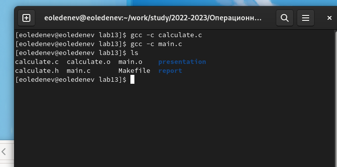
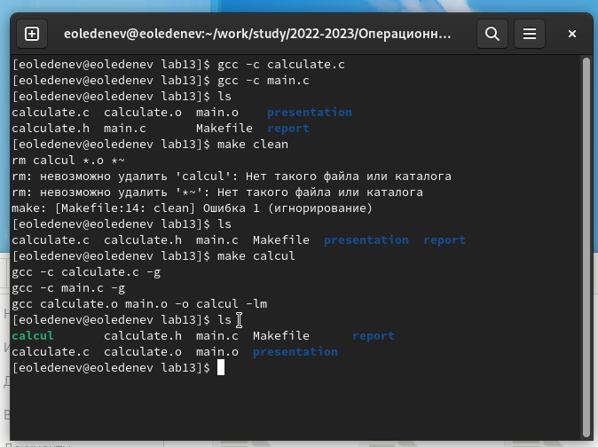
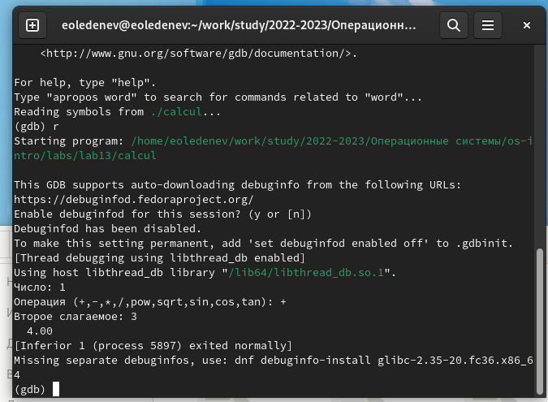
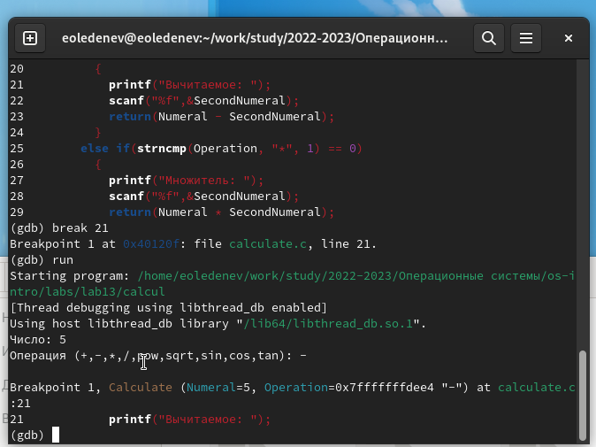
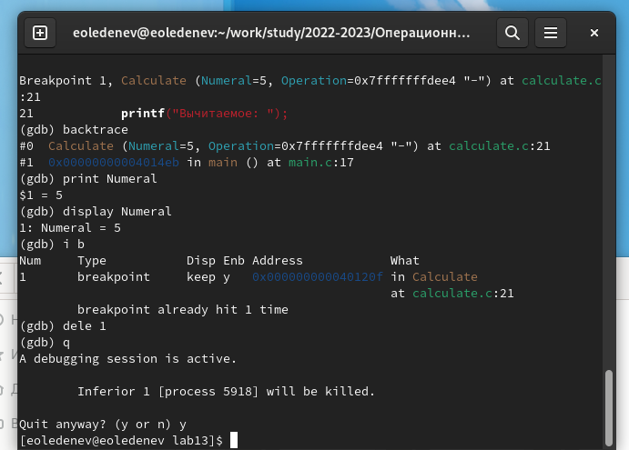
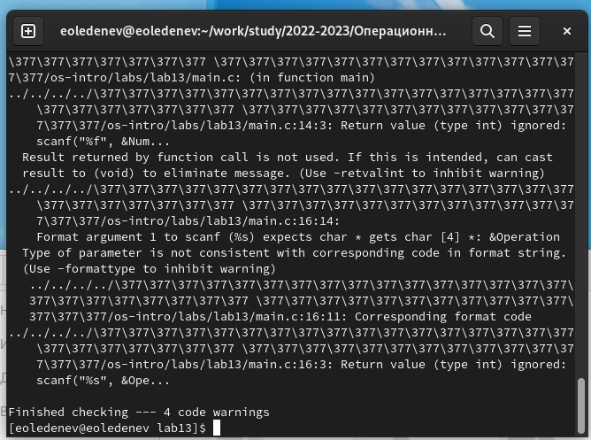

---
# Front matter
lang: ru-RU
title: "Отчёт по лабораторной работе №13"
subtitle: "Средства для создания приложений в ОС UNIX"
author: "Леденев Егор Олегович"

# Formatting
toc-title: "Содержание"
toc: true # Table of contents
toc_depth: 2
lof: true # List of figures
fontsize: 12pt
linestretch: 1.5
papersize: a4paper
documentclass: scrreprt
polyglossia-lang: russian
polyglossia-otherlangs: english
mainfont: PT Serif
romanfont: PT Serif
sansfont: PT Sans
monofont: PT Mono
mainfontoptions: Ligatures=TeX
romanfontoptions: Ligatures=TeX
sansfontoptions: Ligatures=TeX,Scale=MatchLowercase
monofontoptions: Scale=MatchLowercase
indent: true
pdf-engine: lualatex
header-includes:
  - \linepenalty=10 # the penalty added to the badness of each line within a paragraph (no associated penalty node) Increasing the value makes tex try to have fewer lines in the paragraph.
  - \interlinepenalty=0 # value of the penalty (node) added after each line of a paragraph.
  - \hyphenpenalty=50 # the penalty for line breaking at an automatically inserted hyphen
  - \exhyphenpenalty=50 # the penalty for line breaking at an explicit hyphen
  - \binoppenalty=700 # the penalty for breaking a line at a binary operator
  - \relpenalty=500 # the penalty for breaking a line at a relation
  - \clubpenalty=150 # extra penalty for breaking after first line of a paragraph
  - \widowpenalty=150 # extra penalty for breaking before last line of a paragraph
  - \displaywidowpenalty=50 # extra penalty for breaking before last line before a display math
  - \brokenpenalty=100 # extra penalty for page breaking after a hyphenated line
  - \predisplaypenalty=10000 # penalty for breaking before a display
  - \postdisplaypenalty=0 # penalty for breaking after a display
  - \floatingpenalty = 20000 # penalty for splitting an insertion (can only be split footnote in standard LaTeX)
  - \raggedbottom # or \flushbottom
  - \usepackage{float} # keep figures where there are in the text
  - \floatplacement{figure}{H} # keep figures where there are in the text
---

# Цель работы

Приобрести простейшие навыки разработки, анализа, тестирования и отладки приложений в ОС типа UNIX/Linux на примере создания на языке программирования С калькулятора с простейшими функциями.

# Выполнение лабораторной работы

1. Создали подкаталог для файлов лаб работы 

2. Создал в нём файлы: calculate.h , calculate.c , main.c .
Это будет примитивнейший калькулятор, способный складывать, вычитать, умножать и делить, возводить число в степень, брать квадратный корень, вычислять sin, cos, tan. При запуске он будет запрашивать первое число, операцию, второе число. После этого программа выведет результат и остановится.

Код файла calculate.с (реализует функции калькулятора)

```
////////////////////////////////////
// calculate.c

#include <stdio.h>
#include <math.h>
#include <string.h>
#include "calculate.h"

Float Calculate(float Numeral, char Operation[4])
{
  float SecondNumeral;
  if(strncmp(Operation, "+", 1) == 0)
    {
      printf("Второе слагаемое: ");
      scanf("%f",&SecondNumeral);
      return(Numeral + SecondNumeral);
    }
  else if(strncmp(Operation, "-", 1) == 0)
    {
      printf("Вычитаемое: ");
      scanf("%f",&SecondNumeral);
      return(Numeral - SecondNumeral);
    }
  else if(strncmp(Operation, "*", 1) == 0)
    {
      printf("Множитель: ");
      scanf("%f",&SecondNumeral);
      return(Numeral * SecondNumeral);
    }
  else if(strncmp(Operation, "/", 1) == 0)
    {
      printf("Делитель: ");
      scanf("%f",&SecondNumeral);
      if(SecondNumeral == 0)
	{
	  printf("Ошибка: деление на ноль! ");
	  return(HUGE_VAL);
	}
      else
	return(Numeral / SecondNumeral);
    }
  else if(strncmp(Operation, "pow", 3) == 0)
    {
      printf("Степень: ");
      scanf("%f",&SecondNumeral);
      return(pow(Numeral, SecondNumeral));
    }
  else if(strncmp(Operation, "sqrt", 4) == 0)
    return(sqrt(Numeral));
  else if(strncmp(Operation, "sin", 3) == 0)
    return(sin(Numeral));
  else if(strncmp(Operation, "cos", 3) == 0)
    return(cos(Numeral));
  else if(strncmp(Operation, "tan", 3) == 0)
    return(tan(Numeral));
  else
    {
      printf("Неправильно введено действие ");
      return(HUGE_VAL);
    }
}
```

Код файла calculate.h (описывает формат вызова функции калькулятора)

```
///////////////////////////////////////
// calculate.h
#ifndef CALCULATE_H_
#define CALCULATE_H_
float Calculate(float Numeral, char Operation[4]);
#endif /*CALCULATE_H_*/

Код файла main.c (реализует интерфейс пользователя к калькулятору)
////////////////////////////////////////
// main.c

#include <stdio.h>
#include "calculate.h"

Int main (void)
{
  float Numeral;
  char Operation[4];
  float Result;
  printf("Число: ");
  scanf("%f",&Numeral);
  printf("Операция (+,-,*,/,pow,sqrt,sin,cos,tan): ");
  scanf("%s",&Operation);
  Result = Calculate(Numeral, Operation);
  printf("%6.2f\n",Result);
  return 0;
}
```

3. Выполнили компиляцию программы посредством gcc :

{ #fig:001 width=70% }

4. При необходимости исправили синтаксические ошибки.

5. Создали Makefile со следующим содержанием:

```
#
# Makefile
#
CC = gcc
CFLAGS = -g
LIBS = -lm
calcul: calculate.o main.o
gcc calculate.o main.o
-o calcul $(LIBS)
calculate.o: calculate.c calculate.h
gcc -c calculate.c $(CFLAGS)
main.o: main.c calculate.h
gcc -c main.c $(CFLAGS)
clean:
-rm calcul *.o *~
# End Makefile
```

С помощью программы make получаем различные варианты построения исполняемого модуля.

{ #fig:002 width=70% }

4. С помощью gdb выполнил отладку программы calcul

{ #fig:003 width=70% }

{ #fig:004 width=70% }

{ #fig:005 width=70% }

5. С помощью утилиты splint попробовали проанализировать коды файлов

{ #fig:006 width=70% }

# Вывод

Приобрели простейшие навыки разработки, анализа, тестирования и отладки приложений в ОС типа UNIX/Linux на примере создания на языке программирования С калькулятора с простейшими функциями.

