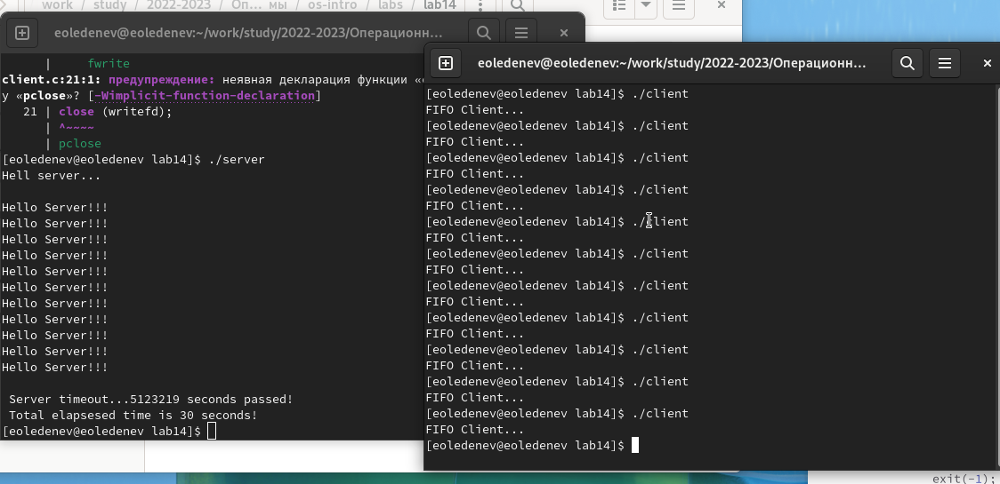

---
# Front matter
lang: ru-RU
title: "Отчёт по лабораторной работе №14"
subtitle: "Именованные каналы"
author: "Леденев Егор Олегович"

# Formatting
toc-title: "Содержание"
toc: true # Table of contents
toc_depth: 2
lof: true # List of figures
fontsize: 12pt
linestretch: 1.5
papersize: a4paper
documentclass: scrreprt
polyglossia-lang: russian
polyglossia-otherlangs: english
mainfont: PT Serif
romanfont: PT Serif
sansfont: PT Sans
monofont: PT Mono
mainfontoptions: Ligatures=TeX
romanfontoptions: Ligatures=TeX
sansfontoptions: Ligatures=TeX,Scale=MatchLowercase
monofontoptions: Scale=MatchLowercase
indent: true
pdf-engine: lualatex
header-includes:
  - \linepenalty=10 # the penalty added to the badness of each line within a paragraph (no associated penalty node) Increasing the value makes tex try to have fewer lines in the paragraph.
  - \interlinepenalty=0 # value of the penalty (node) added after each line of a paragraph.
  - \hyphenpenalty=50 # the penalty for line breaking at an automatically inserted hyphen
  - \exhyphenpenalty=50 # the penalty for line breaking at an explicit hyphen
  - \binoppenalty=700 # the penalty for breaking a line at a binary operator
  - \relpenalty=500 # the penalty for breaking a line at a relation
  - \clubpenalty=150 # extra penalty for breaking after first line of a paragraph
  - \widowpenalty=150 # extra penalty for breaking before last line of a paragraph
  - \displaywidowpenalty=50 # extra penalty for breaking before last line before a display math
  - \brokenpenalty=100 # extra penalty for page breaking after a hyphenated line
  - \predisplaypenalty=10000 # penalty for breaking before a display
  - \postdisplaypenalty=0 # penalty for breaking after a display
  - \floatingpenalty = 20000 # penalty for splitting an insertion (can only be split footnote in standard LaTeX)
  - \raggedbottom # or \flushbottom
  - \usepackage{float} # keep figures where there are in the text
  - \floatplacement{figure}{H} # keep figures where there are in the text
---

# Цель работы

Приобретение практических навыков работы с именованными каналами.

# Выполнение лабораторной работы

Пишем и редактируем программы на С, так чтобы на одном сервере можно было запускать сначала один клиент.
Далее напишем и отредактируем программы, так чтобы на одном сервере можно было запускать больше серверов, чем один, интервал между клиентами будет 5 секунд, сервер завершится через 30 секунд.
Мы имеем 4 файла (программы) это заголовочный файл (common.h) клиент (client.c), сервер (server.c), и Makefile. 

```
////////////////////////////////////
// common.h
#ifndef __COMMON_H__
#define __COMMON_H__
#include <stdio.h>
#include <stdlib.h>
#include <string.h>
#include <errno.h>
#include <sys/types.h>
#include <sys/stat.h>
#include <fcntl.h>
#define FIFO_NAME "/tmp/fifo"
#define MAX_BUFF 80
#endif /* __COMMON_H__ */
```

```
////////////////////////////////////
// client.c
#include "common.h"
#define MESSAGE "Hello Server!!! \n"
int main ()
{
int writefd; 
int msglen;
printf("FIFO Client...\n");
if ((writefd = open(FIFO_NAME, O_WRONLY)) < 0)
{
fprintf(stderr, "%s: Невозможно открыть FIFO (%s)\n",
__FILE__, strerror(errno));
exit(-1);
}
msglen = strlen(MESSAGE);
if (write(writefd, MESSAGE, msglen) != msglen)
{
fprintf(stderr, "%s: Ошибка записи в FIFO (%s)\n",
__FILE__, strerror(errno));
exit(-2);
}
close (writefd);
exit(0);
} 
```

```
////////////////////////////////////
// server.c
#include "common.h"
void display() {
	printf("/n Server timeout...%u seconds passed!\n Total elapsesed time is 30 seconds!\n",clock());
}
int main()
{
clock_t start, now;
start = time(NULL);
int readfd;
int n;
char buff[MAX_BUFF];
printf("Hell server...\n\n");
if(mknod(FIFO_NAME, S_IFIFO | 0666, 0) < 0)
{
fprintf(stderr, "%s: Unable to create FiFO(%s)\n", __FILE__, strerror(errno));
exit(-1);
}
if((readfd = open(FIFO_NAME, O_RDONLY)) < 0)
{
fprintf(stderr, "%s: Unable to open FIFO (%s)\n", __FILE__, strerror(errno));
exit(-2);
}
for(;;)
{
while((n = read(readfd, buff, MAX_BUFF)) > 0)
{
if(write(1, buff, n) != n)
{
fprintf(stderr, "%s: Input error (%s)\n", __FILE__, strerror(errno));
}
sleep(5);
}
now=time(NULL);
if (now-start>30)
{
display();
return 0;
}
}
close(readfd); 
if(unlink(FIFO_NAME) < 0)
{
fprintf(stderr, "%s: unable to delete FIFO (%s)\n", __FILE__, strerror(errno)); 
exit(-4);
}
exit(0);
}
```

```
////////////////////////////////////
// makefile
all: server client
server: server.c common.h
	gcc server.c -o server
client: client.c common.h
	gcc client.c -o client
clean:
	-rm server client *.o
```

Запуск пректа

{ #fig:001 width=70% }

# Вывод

 В данной работе мы приобрели практические навыки работы с именованными каналами по типу клиент-сервер. 
